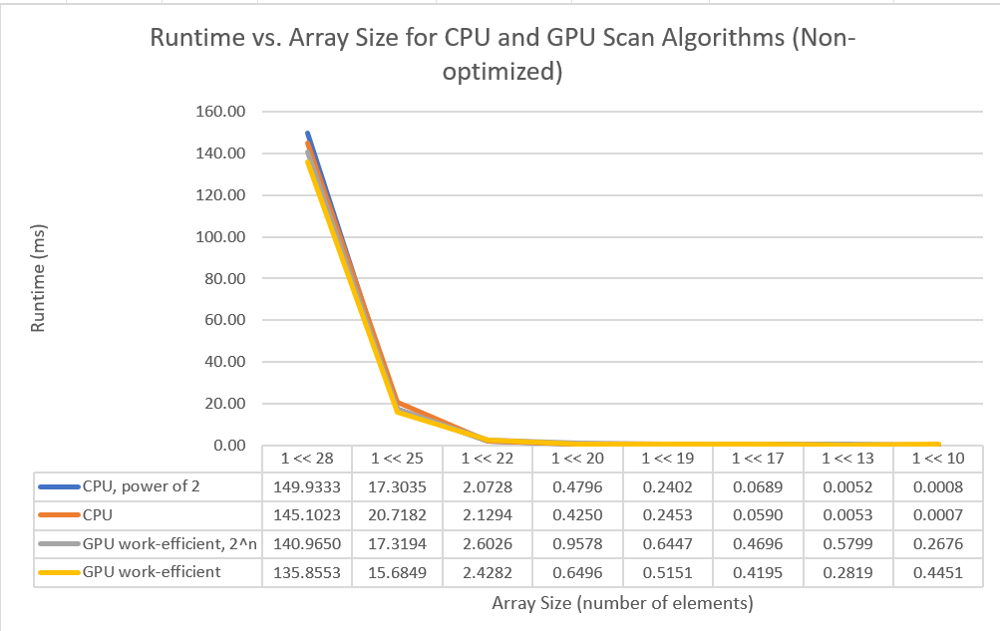
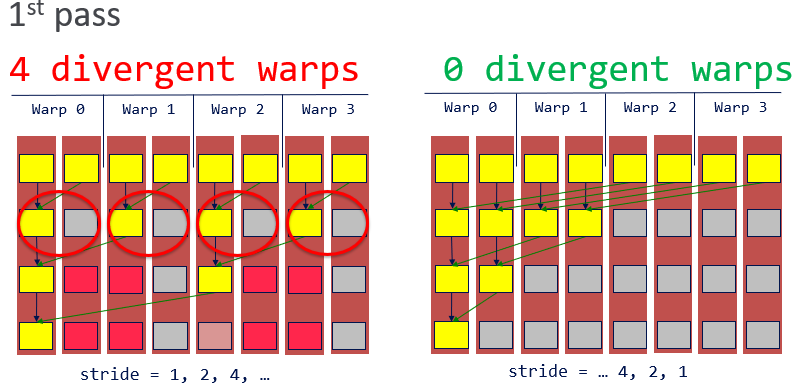
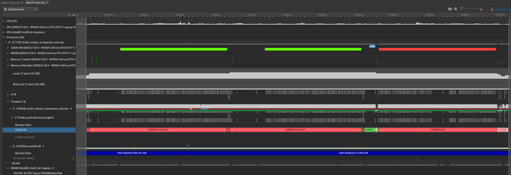

CUDA Scan and Stream Compaction
======================

**University of Pennsylvania, CIS 565: GPU Programming and Architecture, Project 2**

* Linda Zhu
* Tested on: Windows 11, i7-12800H @ 2.40GHz 16GB, NVIDIA GeForce RTX 3070 Ti (Personal Laptop)

## Overview
In this project, I implemented a few different versions of the Scan (Prefix Sum) algorithm in CUDA from scratch (see the list below), and used the CPU scan and GPU work-efficient scan to implement GPU stream compaction that simply removes 0s from an array of ints. This project builds the foundation of culling early-terminated paths from an array of rays in a path tracer. It also helps to reorient your algorithmic thinking to the way how GPU works because n GPUs, many algorithms can benefit from massive parallelism and, in particular, data parallelism: executing the same code many times simultaneously with different data.

Featuring:
  * CPU scan/compact (for GPU comparison)
  * GPU naïve parallel scan/compact
  * GPU work-efficient scan/compact
  * Thrust scan (for GPU comparison)
  * GPU work-efficient scan optimization (extra credit)

## Descriptions

### CPU Scan
Use a for loop to compute an exclusive prefix sum. 


Number of adds: O(n)

### Naive Parallel Scan
Use double-buffer to scan two array. First do exclusive scan, then do shift right to get inclusive scan array.


Naïve Parallel Scan needs O(nlog2(n)) passes.  Each pass is O(n), but really is less in practice, e.g., because of early warp retirement.

### Work-Efficient Parallel Scan

#### Step 1. Up-Sweep (Reduction) Phase:
We first traverse the tree from leaves to the root computing partial sums at internal nodes of the tree.


#### Step 2. Down-Sweep Phase:
Then we traverse back down the tree from the root, using the partial sums from the reduce phase to build the scan in place on the array. We start by inserting zero at the root of the tree, and on each step, each node at the current level passes its own value to its left child, and the sum of its value and the former value of its left child to its right child.


#### Step 3. Finally we convert this exclusive scan to an inclusive scan and output the result.

Up-Sweep: Really n – 1 adds

Down-Sweep: Really n - 1 adds and n - 1 swaps


### Thrust's Implementation

We simply wrap a call to the Thrust library function thrust::exclusive_scan(first, last, result).

### Stream Compation


The goal of stream compaction is that, given an array of elements, we create a new array with elements that meet a certain criteria, e.g. non null and preserve order. It's used in path tracing, collision detection, sparse matrix compression, etc.

* Step 1:  Compute temporary array
* Step 2:  Run exclusive scan on temporary array
* Step 3:  Scatter


## Results
Test case configuration: block size = 512, array size = 2<sup>25</sup>

I added 2 corner cases for my optimized GPU efficient scan in the output with the label "optimized work-efficient scan ...".

```
****************
** SCAN TESTS **
****************
    [  39  25  44  23  36  32  15  35  41  19   6  20  21 ...   8   0 ]
==== cpu scan, power-of-two ====
   elapsed time: 17.503ms    (std::chrono Measured)
    [   0  39  64 108 131 167 199 214 249 290 309 315 335 ... 821771882 821771890 ]
==== cpu scan, non-power-of-two ====
   elapsed time: 20.5698ms    (std::chrono Measured)
    [   0  39  64 108 131 167 199 214 249 290 309 315 335 ... 821771783 821771828 ]
    passed
==== naive scan, power-of-two ====
   elapsed time: 22.0729ms    (CUDA Measured)
    passed
==== naive scan, non-power-of-two ====
   elapsed time: 22.8742ms    (CUDA Measured)
    passed
==== work-efficient scan, power-of-two ====
   elapsed time: 21.3687ms    (CUDA Measured)
    passed
==== work-efficient scan, non-power-of-two ====
   elapsed time: 17.9821ms    (CUDA Measured)
    passed
==== optimized work-efficient scan, power-of-two ====
   elapsed time: 13.8136ms    (CUDA Measured)
    passed
==== optimized work-efficient scan, non-power-of-two ====
   elapsed time: 13.4661ms    (CUDA Measured)
    passed
==== thrust scan, power-of-two ====
   elapsed time: 1.61328ms    (CUDA Measured)
    passed
==== thrust scan, non-power-of-two ====
   elapsed time: 1.93814ms    (CUDA Measured)
    passed


*****************************
** STREAM COMPACTION TESTS **
*****************************
    [   0   1   1   0   1   1   0   0   3   1   0   0   0 ...   3   0 ]
==== cpu compact without scan, power-of-two ====
   elapsed time: 68.2749ms    (std::chrono Measured)
    [   1   1   1   1   3   1   2   3   2   3   2   2   1 ...   1   3 ]
    passed
==== cpu compact without scan, non-power-of-two ====
   elapsed time: 68.3939ms    (std::chrono Measured)
    [   1   1   1   1   3   1   2   3   2   3   2   2   1 ...   3   2 ]
    passed
==== cpu compact with scan ====
   elapsed time: 117.265ms    (std::chrono Measured)
    [   1   1   1   1   3   1   2   3   2   3   2   2   1 ...   1   3 ]
    passed
==== work-efficient compact, power-of-two ====
   elapsed time: 19.442ms    (CUDA Measured)
    passed
==== work-efficient compact, non-power-of-two ====
   elapsed time: 18.6701ms    (CUDA Measured)
    passed
```

## Performance Analysis

### 1. Preliminary runs of non-optimized CPU vs GPU scan implementations
Test case configuration: default block size = 128, array size = [1024, 2<sup>28</sup>]. 3 runs for each array size and plotting using their averages.



*Figure 1: Runtime vs Array Size for CPU and GPU Efficient Scan*

If just implementing the GPU scan version following the described algorithm above, my "efficient" GPU scan is actually not that efficient -- it is even slower than the cpu approach. From the graph we can see that only when the data size is larger than `~5K` (2<sup>22</sup>) did the GPU approach start to show a slight advantage over CPU scan in terms of the runtime. Nevertheless, the small advantage can be trivial.

There can be multiple reasons behind this phenomenon. A major one relates to warp partitioning. In the Up-sweep and Down-sweep phases of the original GPU work-efficient scan, the way we write in the data, i.e. dividing in half/ doubling the number of active threads through array indexing, causes warp divergence (Figure 2). The occupancy is high (active warps / maximum warps available) yet not all threads in each warp are performing some work. To optimize this approach, we partition threads based on consecutive increasing `threadIdx` such that we minimize divergent branches and retire unused warps early. Retired warps can then be scheduled to run something else, thus resulting in better hardware utilization and hiding latency.



*Figure 2: Left is the original parallel reduction (up-sweep) algorithm. Right is a reworked algorithm. In the 1st pass, the original method leads to 4 divergent warps while the tweaked implementation has no divergence. Instead, the reworked method retires 2 warps early (warp 2 and warp 3). For easy understanding and illustration purposes, we assume warp size = 2 here.*

Instead of doing the indexing below during up-sweep (similar for down-sweep),

```
for (int stride = 1; stride < blockDim.x; stride *= 2) {
  if (t % (2 * stride) == 0)
	  partialSum[t] += partialSum[t + stride];
}
// stride = 1, 2, 4, ...
```
we change the condition to determine which thread we should write or not like this: 
```
for (int stride = blockDim.x / 2; stride > 0; stride /= 2) {
  if (t < stride)
    partialSum[t] += partialSum[t + stride];
}
// stride = ... 4, 2, 1
```

In addition, we no longer need to check `modulo %` in the loop, an expensive operation that can take 100s of cycle/ up to 20 instructions on GPU. Less-than operator is considerably faster. **Theoretically speaking**, by updating these index calculation hacks we can achieve a significant performance boost compared to serial CPU scan. **However, my attempt to optimize indexing (for part 5 extra credit) seems unstable because my reworked implementation was even slower than the non-optimized, especially when data size is below 2<sup>22</sup>. Due to time constraint, I couldn't confirm why this happens from time to time. Therefore, for the rest of the performance analysis although I have included sample outputs from the optimized GPU efficient scan, I will not put much weight on its accuracy because of unreliability.**


### 2. Block size optimization for minimal runtime

Test case configuration: power-of-two array size = **2<sup>25</sup> (33,554,432)**, non-power-of-tow array size = (array size - 3), 3 runs for each array size and plotting using their averages.


*Figure 3: Runtime vs Block Size (multiples of 32) for GPU Efficient Scan and Stream Compaction*

For GPU scan, the optimal block size was **128** for the naive, **256** for unoptimized work-efficient, and **256/512** (512 is faster than 256 by a teeny-tiny bit) for optimized work-efficient implementations. For GPU stream compaction, it was also at block size = **256** that the non-optimized work-efficient algorithm has the best performance. It is worth noting that from increasing block size past 256 (512 for optimized efficient scan), there seems no performance gain and in fact, the application starts to slow down quite much. This is well-founded because when too big a block size leads to a lower occupancy of the multiprocessor, it is a BAD approach. Remeber increasing number of threads also heavily affects throughput and available resource, e.g. number of registers each thread will use. These preliminary runs of different block size helped me decide I should use block size = 256 for the GPU vs CPU Scan algorithm comparison below for optimal performance.


### 3. All GPU Scan (Naive, Work-Efficient and Thrust) vs serial CPU Scan Comparison
Test case configuration: block size = 256, array size = [2<sup>17</sup> (131,072), 2<sup>28</sup> (268,435,456)] 


*Figure 4 & 5: Runtime vs Array Size in both power of 2 and non-power of 2 for all the Scan algorithms*

As can be seen in Figure 4 & 5, the runtime of the scan algorithm increases smoonthly for each of the implementation when the array size is smaller than **2<sup>20</sup>** and peaks steeply past **2<sup>25</sup>**. The Thrust library version was always the best and outperforms the other implementations by at maximum **30x** faster. In all test cases, the Thrust version maintains a runtime below 10ms, which is reasonable because it is a well-established GPU library that is developed for high performance applications. To guess at what might be happening inside the Thrust implementation (e.g. allocation, memory copy), refer to the analysis down below where I used Nsight Timeline for its execution.

The optimized work-efficient parallel scan is the next best version. This is sometimes slower than the CPU (when data size is small as I mentioned) but always faster than the naive parallel version in the long run. My guess why it can be slower than the CPU version is that it is only using global memory, the type of GPU memory with the highest latency. Especially when compared to the CPU version's cache coherency, this is a huge bottleneck on the algorithm. Another problem of both the optimized and the original wor-efficient scan is that the number of threads remains constant each iteration. This means that, during both the up sweep and down sweep phases, there are potentially thousands of blocks launched for a process, while only one or a few threads are actually active at a time. A more optimized version of the algorithm would 1. dynamically shrink/ expand the block size so that in each level of depth in scanning we can terminate idle threads, 2. switch to shared memory for faster data access.

The next best version was the CPU scan. While this is initially suprising, there are a couple benefits the CPU version has with respect to the GPU versions. First, the logic is very simple for computing each element of the output, and the serial nature of the algorithm means it is very cache coherent. It also requires no additional memory allocation (CPU or GPU), which all the GPU parallel versions require.

Finally, the naive parallel scan is the worst. For 33 million array size, this algorithm is 50% worse than the optimized efficient parallel scan, and 30x slower than the thrust library implementation.

### 4. A Sneak Peak of Thrust Implementation



*Figure 6: Nsight Timeline on Thrust Eclusive Scan operation*

I checked Nsight Timeline within Nsight Compute 2023.2.2 using the test case where array size is 2<sup>25</sup>. The function call of thrust::exclusive_scan is about one half of each kernel sweep call. We can see in the Thrust implementation most expense is on device memory allocation and memory copy based on the time span of `cudaMemcpyAsync` and `cudaMemcpy` executions. I guess the basic cost for memory operation is quite big in Thrust, but as the array size grows, since it might has some kind of memory access optimization like contiguous access, the memory operation cost might not increase a lot. As a result, in a large array thrust implementation has the best performance.


## References
* UPenn CIS5650 [Slides on Parallel Algorithms](https://docs.google.com/presentation/d/1ETVONA7QDM-WqsEj4qVOGD6Kura5I6E9yqH-7krnwZ0/edit#slide=id.p126)
  for Scan, Stream Compaction, and Work-Efficient Parallel Scan.
* GPU Gems 3, Chapter 39 - [Parallel Prefix Sum (Scan) with CUDA](https://developer.nvidia.com/gpugems/GPUGems3/gpugems3_ch39.html).
    - This online version contains a few small errors (in superscripting, missing braces, bad indentation, etc.)
    - We maintain a fix for this at [GPU Gem 3 Ch 39 Patch](https://github.com/CIS565-Fall-2017/Project2-Stream-Compaction/blob/master/INSTRUCTION.md#gpu-gem-3-ch-39-patch). If you find more errors in the chapter, welcome to open new pull requests to contribute.
* UPenn CIS5650 Project 2 [Recitation slides](https://docs.google.com/presentation/d/1daOnWHOjMp1sIqMdVsNnvEU1UYynKcEMARc_W6bGnqE/edit?usp=sharing)
* [Nsight Compute Tools Documentation](https://docs.nvidia.com/nsight-compute/NsightCompute/index.html)
