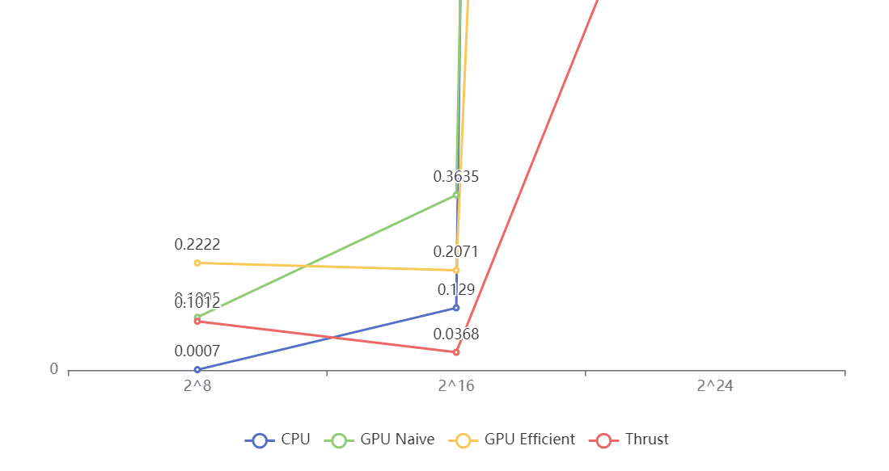

CUDA Stream Compaction
======================

**University of Pennsylvania, CIS 565: GPU Programming and Architecture, Project 2**

* Janet Wang
  * https://xchennnw.github.io/
* Tested on: Windows 11, i7-12700H @ 2.30GHz 16GB, Nvidia Geforce RTX 3070 Ti  8054MB

### TODO implemented
* CPU Scan & Stream Compaction
* Naive GPU Scan Algorithm
* Work-Efficient GPU Scan & Stream Compaction
* Scan using Thrust
  
### Project Description 
This project is about GPU stream compaction in CUDA, including a few different versions of the Scan (Prefix Sum) algorithm: a CPU version, GPU naive scan, GPU "work-efficient" scan, and GPU scan using thrust. It also includes GPU stream compaction using the above algorithms.

### Performance Analysis 


*  When the array size is greater than 2^8, thrus scan always has the best performance.
*  When the array size is under 2^16, CPU scan is faster than both of the GPU naive scan and work-efficient scan. The rational explanation could be the cost of GPU reading data from global memory is a relatively large part of time cost when array size is small.
*  The GPU efficient scan perferms better than naive only after the the array size is greater than 2^16. I am actually confused about this point.
*  When the array size is greater than 2^16, the rank of the methods becomes relatively stable: thrust > GPU efficient > GPU naive > CPU

This is the Nsight timeline for the execution of GPU scan using thrust. It seems like cudaMemcpyAsync() and cudaStreamSynchronize are used here, but to be honest I do not quite understand what happens in these two functions and how they significantly improve the performance.

### Output of the test program
SIZE = 1 << 24
```
****************
** SCAN TESTS **
****************
    [  43   2   2  48  43  19  31  48  40  42  13  19  31 ...   6   0 ]
==== cpu scan, power-of-two ====
   elapsed time: 41.2005ms    (std::chrono Measured)
    [   0  43  45  47  95 138 157 188 236 276 318 331 350 ... 410823510 410823516 ]
==== cpu scan, non-power-of-two ====
   elapsed time: 43.9688ms    (std::chrono Measured)
    [   0  43  45  47  95 138 157 188 236 276 318 331 350 ... 410823427 410823469 ]
    passed
==== naive scan, power-of-two ====
   elapsed time: 26.7661ms    (CUDA Measured)
    passed
==== naive scan, non-power-of-two ====
   elapsed time: 27.9169ms    (CUDA Measured)
    passed
==== work-efficient scan, power-of-two ====
   elapsed time: 12.5882ms    (CUDA Measured)
    passed
==== work-efficient scan, non-power-of-two ====
   elapsed time: 13.1602ms    (CUDA Measured)
    passed
==== thrust scan, power-of-two ====
   elapsed time: 1.37734ms    (CUDA Measured)
    passed
==== thrust scan, non-power-of-two ====
   elapsed time: 1.35168ms    (CUDA Measured)
    passed

*****************************
** STREAM COMPACTION TESTS **
*****************************
    [   0   3   2   0   0   0   1   3   1   0   1   3   2 ...   3   0 ]
==== cpu compact without scan, power-of-two ====
   elapsed time: 49.1391ms    (std::chrono Measured)
    [   3   2   1   3   1   1   3   2   1   3   3   1   3 ...   1   3 ]
    passed
==== cpu compact without scan, non-power-of-two ====
   elapsed time: 51.6044ms    (std::chrono Measured)
    [   3   2   1   3   1   1   3   2   1   3   3   1   3 ...   1   1 ]
    passed
==== cpu compact with scan ====
   elapsed time: 116.318ms    (std::chrono Measured)
    [   3   2   1   3   1   1   3   2   1   3   3   1   3 ...   1   3 ]
    passed
==== work-efficient compact, power-of-two ====
   elapsed time: 12.9027ms    (CUDA Measured)
    passed
==== work-efficient compact, non-power-of-two ====
   elapsed time: 13.2913ms    (CUDA Measured)
    passed
```
