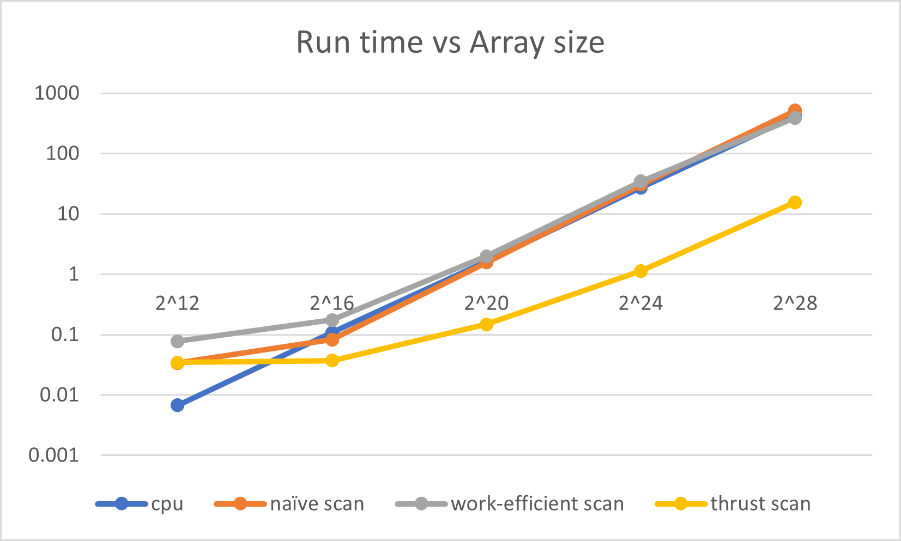

CUDA Stream Compaction
======================

**University of Pennsylvania, CIS 565: GPU Programming and Architecture, Project 2**

* Zhiyu Lei
  * [LinkedIn](https://www.linkedin.com/in/zhiyu-lei/), [Github](https://github.com/Zhiyu-Lei)
* Tested on: Windows 22, i7-2222 @ 2.22GHz 22GB, GTX 222 222MB (CETS Virtual Lab)

### Project Description
* CPU Scan & Stream Compaction & Quick Sort ([stream_compaction/cpu.cu](stream_compaction/cpu.cu))
* Naive GPU Scan Algorithm ([stream_compaction/naive.cu](stream_compaction/naive.cu))
* Work-Efficient GPU Scan & Stream Compaction([stream_compaction/efficient.cu](stream_compaction/efficient.cu))
* Using Thrust's Implementation ([stream_compaction/thrust.cu](stream_compaction/thrust.cu))
* Radix Sort ([stream_compaction/radix_sort.cu](stream_compaction/radix_sort.cu))

### Performance Analysis
#### Roughly optimize the block sizes of each of your implementations for minimal run time on your GPU.
The following table shows a comparison of run time (in milliseconds) between various block sizes for each of the implementations. The run time is measured by scanning an array of size $2^{20}$. The block size does not affect performance very significantly, but a block size of 128 seems to be optimal.
block size|naive scan|work-efficient scan|thrust scan
:---:|:---:|:---:|:---:
64|1.6761|3.0861|0.1686
128|1.5749|1.9997|0.1480
256|1.8605|2.1077|0.1639
512|1.6586|2.5638|0.1679

#### Compare all of these GPU Scan implementations to the serial CPU version of Scan. Plot a graph of the comparison (with array size on the independent axis).

With a smaller array size, CPU scan is faster than GPU scan; but with a larger array size, GPU scan, especially Thrust's implementation, tends to be faster, and work-efficient scan also becomes faster than naive scan. Theoretically, GPU scan algorithms' run time increases logarithmically against the array size, but the plot does not show any sublinear trend.

#### Write a brief explanation of the phenomena you see here.
Since I implemented both naive and work-efficient scan algorithms using global memory, the performance bottlenecks were mainly memory I/O. Accessing to global memory is more costly than accessing to shared memory. As for Thrust's implementation, the Nsight timeline shows the occupancy is full, so it tends to use the computability as much as possible.

#### Test Program Output
Array size is $2^{20}$, and array values are in range $[0,1000)$. Radix sort tests are added.
```
****************
** SCAN TESTS **
****************
    [ 559 897 331 240 911 774 261 359 471 923 455 970 436 ... 674   0 ]
==== cpu scan, power-of-two ====
   elapsed time: 1.7442ms    (std::chrono Measured)
    [   0 559 1456 1787 2027 2938 3712 3973 4332 4803 5726 6181 7151 ... 521313475 521314149 ]
==== cpu scan, non-power-of-two ====
   elapsed time: 1.7567ms    (std::chrono Measured)
    [   0 559 1456 1787 2027 2938 3712 3973 4332 4803 5726 6181 7151 ... 521311914 521312911 ]
    passed
==== naive scan, power-of-two ====
   elapsed time: 1.56285ms    (CUDA Measured)
    passed
==== naive scan, non-power-of-two ====
   elapsed time: 1.55731ms    (CUDA Measured)
    passed
==== work-efficient scan, power-of-two ====
   elapsed time: 1.99274ms    (CUDA Measured)
    passed
==== work-efficient scan, non-power-of-two ====
   elapsed time: 1.99523ms    (CUDA Measured)
    passed
==== thrust scan, power-of-two ====
   elapsed time: 0.187808ms    (CUDA Measured)
    passed
==== thrust scan, non-power-of-two ====
   elapsed time: 0.166112ms    (CUDA Measured)
    passed

*****************************
** STREAM COMPACTION TESTS **
*****************************
    [ 559 897 331 240 911 774 261 359 471 923 455 970 436 ... 674   0 ]
==== cpu compact without scan, power-of-two ====
   elapsed time: 0.3507ms    (std::chrono Measured)
    [ 559 897 331 240 911 774 261 359 471 923 455 970 436 ... 356 674 ]
    passed
==== cpu compact without scan, non-power-of-two ====
   elapsed time: 0.4523ms    (std::chrono Measured)
    [ 559 897 331 240 911 774 261 359 471 923 455 970 436 ... 997 208 ]
    passed
==== cpu compact with scan ====
   elapsed time: 3.6566ms    (std::chrono Measured)
    [ 559 897 331 240 911 774 261 359 471 923 455 970 436 ... 356 674 ]
    passed
==== work-efficient compact, power-of-two ====
   elapsed time: 2.19942ms    (CUDA Measured)
    passed
==== work-efficient compact, non-power-of-two ====
   elapsed time: 4.09008ms    (CUDA Measured)
    passed

**********************
** RADIX SORT TESTS **
**********************
    [ 559 897 331 240 911 774 261 359 471 923 455 970 436 ... 674   0 ]
==== cpu sort, power-of-two ====
   elapsed time: 50.9862ms    (std::chrono Measured)
    [   0   0   0   0   0   0   0   0   0   0   0   0   0 ... 999 999 ]
==== radix sort, power-of-two ====
   elapsed time: 74.2602ms    (CUDA Measured)
    passed
==== cpu sort, non-power-of-two ====
   elapsed time: 53.0439ms    (std::chrono Measured)
    [   0   0   0   0   0   0   0   0   0   0   0   0   0 ... 999 999 ]
==== radix sort, non-power-of-two ====
   elapsed time: 71.4663ms    (CUDA Measured)
    passed
```