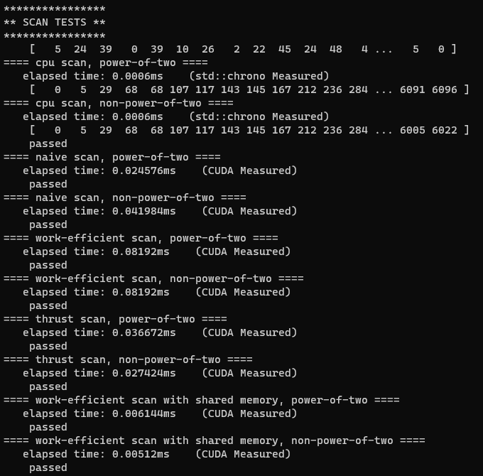
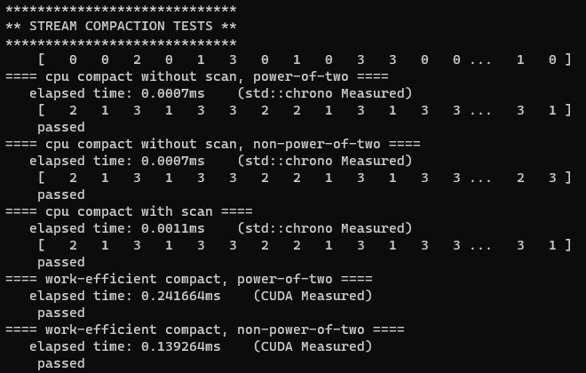
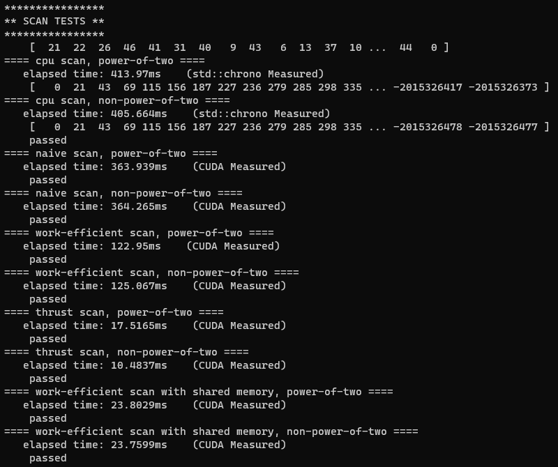
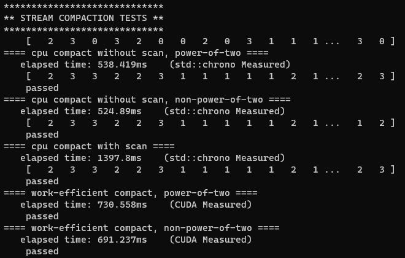
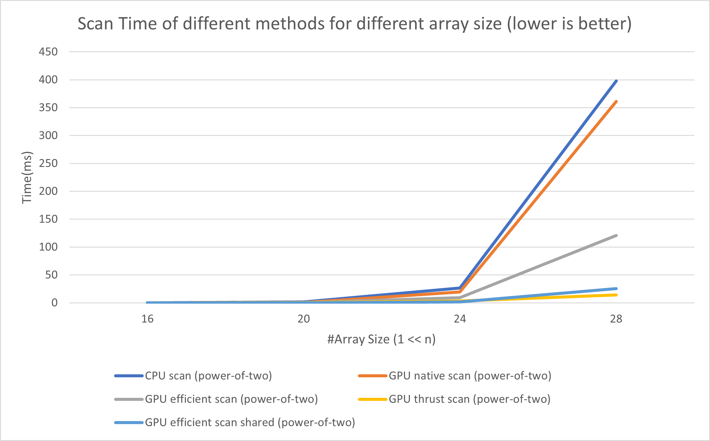
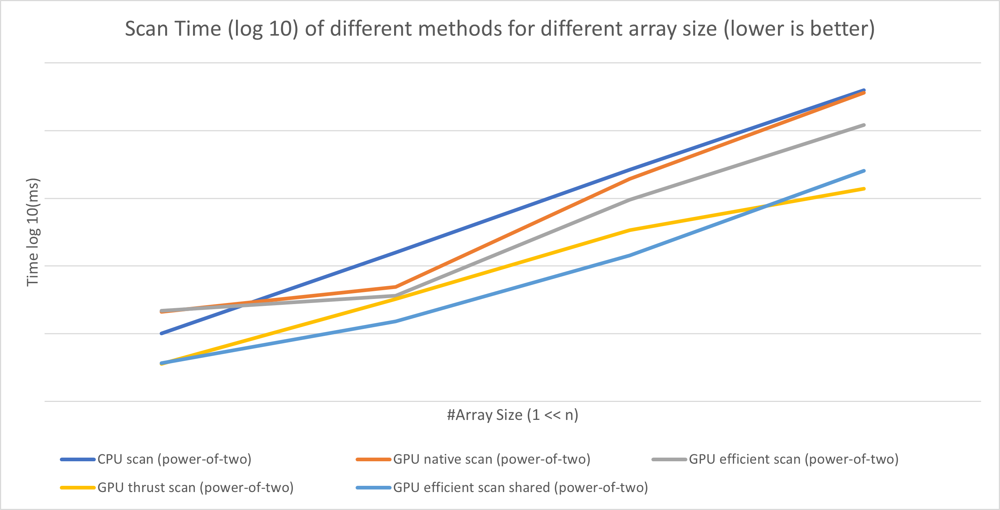
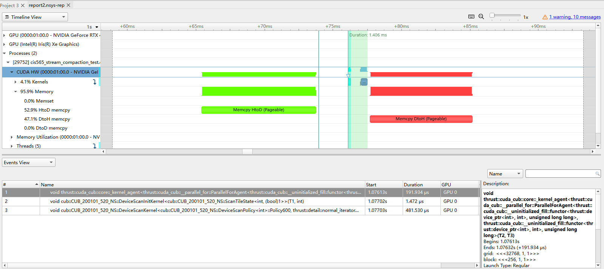

CUDA Stream Compaction
======================

**University of Pennsylvania, CIS 565: GPU Programming and Architecture, Project 2**

* Yue Zhang
  * [LinkedIn](https://www.linkedin.com/in/yuezhang027/), [personal website](https://yuezhanggame.com/).
* Tested on: Windows 11, i9-13900H @ 2.60GHz 32GB, NVIDIA GeForce RTX 4070 Laptop 8GB (Personal Laptop)
* Compute capability: 8.9

## Description
This project explores various stream compaction and exclusive scan algorithms capable of handling arbitrary-length input arrays. The algorithms are derived from the [slides on Parallel Algorithms](https://docs.google.com/presentation/d/1ETVONA7QDM-WqsEj4qVOGD6Kura5I6E9yqH-7krnwZ0/edit#slide=id.p126) and GPU Gems 3, Chapter 39 - [Parallel Prefix Sum (Scan) with CUDA](https://developer.nvidia.com/gpugems/GPUGems3/gpugems3_ch39.html). In addition to basic implementation, the project tries to enhance performance through optimization techniques and includes a detailed analysis of the time metrics involved.

Here is the list of features this project implemented:

1. Exclusive scan and stream compaction implementation performed on CPU.
2. Naive exclusive scan algorithm implementation performed on GPU.
3. Work-Efficient exclusive scan and stream compaction implementation performed on  GPU. 
4. [Extra Credit] Try to optimize work-efficient exclusive scan by modifying blockSize, gridSize and internal visit.
5. Thrust exclusive scan wrapper performed on GPU.
6. [Extra Credit] Optmized work-efficient exclusive scan using shared memory implementation.


## Results
Here are screenshots for performance of all algorithm with array size n = 1<<8 and 1<<28 for the base case and stress test case. The results include extra test for work-efficient scan with shared memory:

<center>Screenshot 1: Test result with array size = 1 << 8</center>





<center>Screenshot 2: Test result with array size = 1 << 28</center>





There is also a NSight Analysis for the time and memory operation for each method with two tests since it directly call scan() function.


Note for work-efficient compact, there is still some malloc and free calculated in the result time.

## Analysis with questions

* Roughly optimize the block sizes of each of your implementations for minimal
  run time on your GPU.
  
  I optmize the block size according to the CUDA device property to maximize the utilization of each warp and align the blocks to be distributed uniformly along all SMs. Especially in work-efficient algorithm, the `threadCount` for each level of tree is different, which require a dynamic block size assignment. Here, I rely on three properties in implementation of naive and work-efficient GPU exclusive scan to determine `blockSize` and `gridSize`:
  * `warpSize`: Block size is set to be a multiple of warp size to ensure maximum utilization of each warp and avoid warp divergence.
  * `maxThreadsPerBlock`: Block size should not exceed this limit.
  * `multiProcessorCount`: After aligning the native gridSize by finding `threadCount` / `blockSize`, this value should be ideally a multiple of the number of SMs to ensure a balanced workload distribution across all SMs.

  Here is a typical grid and block size setting code:
  ```
  cudaDeviceProp prop;
  cudaGetDeviceProperties(&prop, 0);
  int minBlockSize = prop.warpSize, 
      maxBlockSize = prop.maxThreadsPerBlock, sms = prop.multiProcessorCount;

  int curBlockSize = std::max(minBlockSize, std::min(64/*start block size*/,      
      maxBlockSize));
  int curGridSize = (threadCount + curBlockSize - 1) / curBlockSize;
  curGridSize = std::ceil(curGridSize / (float)sms) * sms;

  kernfunc<<<curGridSize, curBlockSize >>>(threadCount, ...);
  ```

  Besides, in work-efficient algorithm implementation using shared memory, I take `sharedMemPerBlock` into account too when deciding the block division along a large array. The algorithm will start a grid with dimension <<<N / B, B / 2>>> and assign B * sizeof(int) byte shared memory to each block. B should be a value less than `sharedMemPerBlock` / sizeof(int).

* Compare all of these GPU Scan implementations (Naive, Work-Efficient, and
  Thrust) to the serial CPU version of Scan. Plot a graph of the comparison
  (with array size on the independent axis).
  
  Here is a graph of scan time for different method's implementation under an array size from 1 << 16 to 1 << 28. This chart only runs the power-of-two tests.

  

  This chart reflects a tendency and rough comparison between each methods' behavior. At 1 << 28 array size case, we may see naive GPU scan performs a little bit better than the CPU scan, while the first GPU work-efficient scan is much better than them. The optimized GPU work-efficient scan is almost performing as good as the thrust scan due to the utilization of shared memory and avoiding bank conflict.

  The next graph use log10 scale for time to see the comparison of method performance for each level of array size more clearly.

  

  The algorithm's performance are relatively unstable along different array size. The baseline, CPU scan performs a linear increment in log10 scale, that means it follows an exponential growth as array size increases. In contradiction, the GPU scans using global memory (GPU native scan, GPU efficient scan) suffered from the inefficient memory visit at first. When array size increases, they begins to perform better from parallel feature. As array size increases, the efficient scan overvalues native scan, since it performs O(n) operation other than O(nlogn) in native scan.

* To guess at what might be happening inside the Thrust implementation (e.g.
    allocation, memory copy), take a look at the Nsight timeline for its
    execution. Your analysis here doesn't have to be detailed, since you aren't
    even looking at the code for the implementation.

    Here is the Nsight timeline screenshot of Thrust scan:
    

    It may operates similarly to the shared memory version of work efficient scan. 
    1. `__uninitialized_fill`: First, it tries to fill the shared memory with for loops.
    2. `ScanTileState`: Then, it scan states (refers to the recursive call on sum array in shared memory version of algorithm) to store the intermediate state in the scan operation (just like what I do with int **sumArr).
    3. `DeviceScanPolicy`: Finally, for each state, it performs the prefix scan as we do in the block.

* Write a brief explanation of the phenomena you see here.

  For native scan and work-efficient scan, the global memory access may really be a bottleneck of their performance. Work-efficient scan visits memory in a better efficiency than the normal one, since one thread handles two elements at the same time, and they don't conflict with each other. Also, when gridId increases, the thread executes with a longer time. This may caused by unbalanced workload along SMs.

  

  The optimized method of work-efficient scan changes memory to shared memory, avoids bank conflict by setting offset (2 * n shared memory needed) and allows the array to be divided into several length and compute with different blocks. The main bottleneck for this method may be still about auto-balancing between threads and compaction of active threads or optimizing the sumArr visit. This has a performance increase about 20% in measured scan time.

  

* Paste the output of the test program into a triple-backtick block in your
  README.

  Another run with array size = 1 << 28. There is extra test for work-efficient scan with shared memory.
  ```
  ****************
  ** SCAN TESTS **
  ****************
      [  27  35  35  40  20   6  13  34  36  15  47   4  41 ...  25   0 ]
  ==== cpu scan, power-of-two ====
    elapsed time: 400.187ms    (std::chrono Measured)
      [   0  27  62  97 137 157 163 176 210 246 261 308 312 ... -2015767044 -2015767019 ]
  ==== cpu scan, non-power-of-two ====
    elapsed time: 406.071ms    (std::chrono Measured)
      [   0  27  62  97 137 157 163 176 210 246 261 308 312 ... -2015767115 -2015767102 ]
      passed
  ==== naive scan, power-of-two ====
    elapsed time: 280.021ms    (CUDA Measured)
      passed
  ==== naive scan, non-power-of-two ====
    elapsed time: 280.801ms    (CUDA Measured)
      passed
  ==== work-efficient scan, power-of-two ====
    elapsed time: 94.5782ms    (CUDA Measured)
      passed
  ==== work-efficient scan, non-power-of-two ====
    elapsed time: 94.4707ms    (CUDA Measured)
      passed
  ==== thrust scan, power-of-two ====
    elapsed time: 11.0101ms    (CUDA Measured)
      passed
  ==== thrust scan, non-power-of-two ====
    elapsed time: 10.5656ms    (CUDA Measured)
      passed
  ==== work-efficient scan with shared memory, power-of-two ====
    elapsed time: 18.8852ms    (CUDA Measured)
      passed
  ==== work-efficient scan with shared memory, non-power-of-two ====
    elapsed time: 19.1417ms    (CUDA Measured)
      passed

  *****************************
  ** STREAM COMPACTION TESTS **
  *****************************
      [   2   3   2   2   1   0   3   2   2   1   0   2   3 ...   0   0 ]
  ==== cpu compact without scan, power-of-two ====
    elapsed time: 518.492ms    (std::chrono Measured)
      [   2   3   2   2   1   3   2   2   1   2   3   3   3 ...   3   3 ]
      passed
  ==== cpu compact without scan, non-power-of-two ====
    elapsed time: 527.604ms    (std::chrono Measured)
      [   2   3   2   2   1   3   2   2   1   2   3   3   3 ...   2   3 ]
      passed
  ==== cpu compact with scan ====
    elapsed time: 1249.16ms    (std::chrono Measured)
      [   2   3   2   2   1   3   2   2   1   2   3   3   3 ...   3   3 ]
      passed
  ==== work-efficient compact, power-of-two ====
    elapsed time: 141.99ms    (CUDA Measured)
      passed
  ==== work-efficient compact, non-power-of-two ====
    elapsed time: 117.638ms    (CUDA Measured)
      passed
  ```
