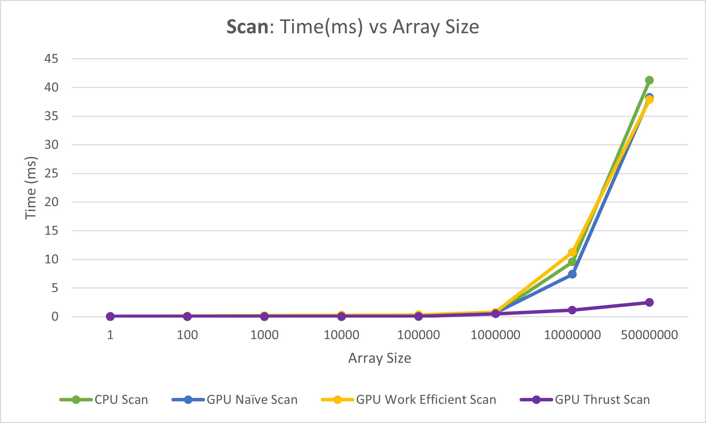
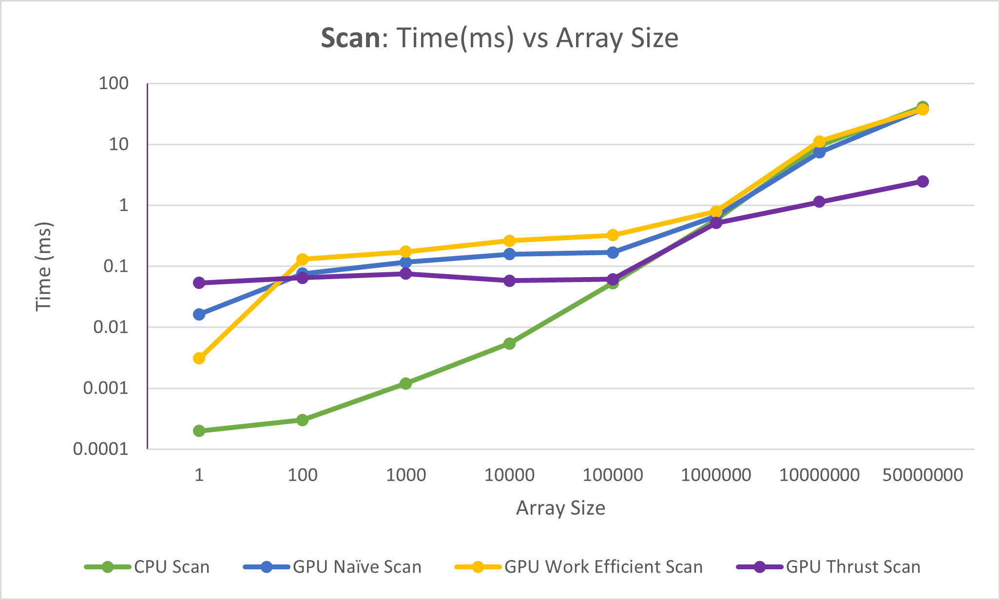
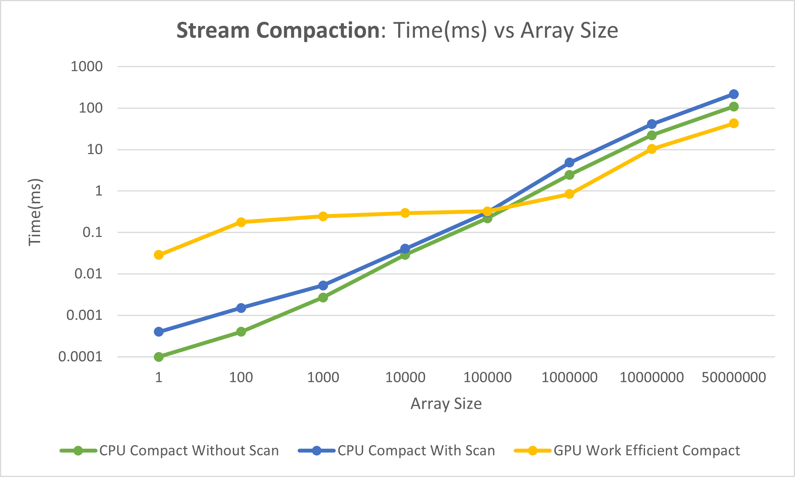

CUDA Stream Compaction
======================

**University of Pennsylvania, CIS 565: GPU Programming and Architecture, Project 2**

* Utkarsh Dwivedi
  * [LinkedIn](https://www.linkedin.com/in/udwivedi/), [personal website](https://utkarshdwivedi.com/)
* Tested on: Windows 11 Home, AMD Ryzen 7 5800H @ 3.2GHz 16 GB, Nvidia GeForce RTX 3060 Laptop GPU 6 GB

# Introduction

This project is an implementation of the scan and stream compaction algorithms, both sequentially on the CPU as well as in parallel on the GPU using CUDA, and a performance analysis and comparison of different implementations of the algorithm.

## Algorithms

### Scan
Scan computes the prefix sum of the array so that each element in the resulting array is the sum of all the elements occuring before it. This project contains the following implementations of scan:

1. **Sequential CPU scan**: A simple scan algorithm that runs sequentially on the CPU using a for loop.
2. **Naive GPU parallel scan**: A scan algorithm that runs in parallel on the GPU and sums over adjacent elements while halving the array size each iteration
3. **Work efficient GPU parallel scan**: A more performant parallel scan on the GPU that treats the array like a binary tree and runs in two steps: an "up-sweep" and then a "down-sweep"

**Note:** For both of the GPU scans, the algorithms only work for arrays with power of 2 size. For non-power of 2 size arrays, the data is padded with 0s until the array size becomes the next power of 2. This has potential to be improved, as at the current moment it has the potential of launching a large number of threads that compute unnecessary data. For an array of size **2<sup>n</sup>+1**, the array will be expanded to size **2<sup>16</sup>**, padding the last (**2<sup>n+1</sup> - 2<sup>n</sup>+1**) elements with 0s. This is acceptable for arrays with small values of **n**, but say for arrays of size **4097**, the array will be padded to **8192** elements, leading to **4095** unnecessary computations.

### Stream Compaction
Stream compaction is an algorithm that, given an array and some condition, creates and returns a new array that contains only those elements from the original array that satisfy the given condition, and the order of the elements in the resulting array is preserved. In this project, stream compaction simply removes all `0s` from an array of integers, but it can easily be extended to work as a template on any given conditions. This project contains the following implementations of stream compaction:

1. **Simple CPU stream compaction**: A simple algorithm that runs sequentially on the CPU using a for loop and simply removes all elements that are 0
2. **CPU stream compaction using CPU scan**: A CPU side imitation of stream compaction in parallel, using the scan algorithm
3. **GPU stream compaction using GPU work efficient scan**: Proper implementation of stream compaction in parallel using the parallel scan algorithm on the GPU

**Note**: The power of 2 note from the scan algorithms is still valid here, as the GPU stream compaction uses the GPU scan algorithm.

# Performance Analysis

## Time(ms) vs Block Size (optimizing block size)

This project was first executed on an array of size **2<sup>20</sup>** with different block sizes to roughly optimize them.

|  |
|:--:|
| **Scan**: time (ms) vs block size (# of threads per block)

There is little gain in performance beyond 128 threads, so further performance analysis was done with block size set to **128**.

**Note**: It is shocking to see the GPU work-efficient scan algorithm perform worse than the GPU naive scan algorithm. More info on that below.

## Time (ms) vs Array Size

### Scan

Each of the scan implementations (CPU, GPU Naive, GPU Work-Efficient) was compared against each other with increasing array sizes. Additionally, the results were also compared against Nvidia's thrust library's `exclusive_scan`.

|  |
|:--:|
| *Graph 1*. **Scan**: time (ms) vs array size, Block Size: 128, time scales linearly |

In the above graph, time scales linearly on the Y-axis. For smaller arrays, there seems to be not much difference in performance in all four cases, but with increasing array size, thrust is the clear winner in terms of performance.

|  |
|:--:|
| *Graph 2*. **Scan**: time (ms) vs array size, Block Size: 128, time scales logarithmically |

In the above graph, time scales logarithmically on the Y-axis. It is the same data as in *Graph 1*, but it more clearly shows what is going on in arrays of smaller sizes. **It is very interesting to see that the CPU scan is even faster than thrust for upto 100,000 array size!**

What is surprising, as mentioned earlier, is that the work-efficient GPU scan algorithm is *slower* than both the CPU and also the naive GPU algorithm. This makes very little sense, because while it makes sense for the CPU version to be faster for smaller arrays, the naive version should not be faster than the work-efficient version.

**What could be going wrong? Why are the GPU implementations so slow?**

I believe this is happening due to a combination of multiple reasons.

- Every iteration the up-sweep and down-sweep kernels are launched, the number of meaningful computations is halved. However, the number of threads remains the same, therefore the number of threads doing meaningful work is halved every iteration of the kernels.
- This would still be okay, except for the fact that the algorithm works in a way where every `s` threads do meaningful computations, where `s = stride`. This leads to branching in every single block, but the goal should be to minimize branching as much as possible. It would make more sense to rework the indexing in the algorithm so that the threads doing meaningful computations are shifted. Instead of every `s` thread doing the compute, each thread *until* `s` should do meaningful compute. The second half of the threads that do no work can be retired early for use in other compute.
- Neither the naive nor the work-efficient scans use shared memory, and therefore do not utilize CUDA's capability to the fullest.

**Why is the thrust scan implementation significantly faster?**

Thrust likely uses many optimizations in its implementation of scan, such as the ones mentioned above.

Below is a screenshot of the Nsight timeline for this program.

||
|:--:|
|Image 1|

The <span style="color:#66FF00">green</span> sections show time spent in copying over memory from the device to the host, and the <span style="color:#FF4040">red</span> sections show time spent in copying over memory back from the host to device. These take the most amount of time.

The <span style="color:#889CD2">purple</span> coloured sections are the actual kernels. This project's naive and work-efficient scan implementations take 27.4% of all kernel execution time, whereas thrust's `DeviceScanInitKernel` and `DeviceScanKernel` take only 1.2% of the total kernel execution time.

If we zoom into the `kernelScan` section that takes 27.4% of all kernel execution time, we can see that there is not one, but several kernels executed at regular intervals.

||
|:--:|
|Image 2|

These kernels are this project's implementation of the naive and work-efficient kernels. The CPU launches many kernels based on the array size, where the number of threads doing compute reduces by half in every iteration, as explained in the previous sections.

Compare that to the very tiny thrust's scan below (zoomed 100X so that the tiny section from the right side of Image 1 is visible):

||
|:--:|
|Image 3|

Thrust seems to only launch 2 kernels for arrays of arbitrary size: one to initialize the data, and another one to perform the actual scan. In addition to the optimisations mentioned above, it seems that thrust either performs the up-sweep and down-sweep simultaneously while also managing the iterations on the GPU side, or it uses an entirely more efficient algorithm altogether that performs the scan in-place.

### Stream Compaction

Each of the stream compaction implementations was compared against each other with increasing array sizes.

|  |
|:--:|
| *Graph 3*. **Stream Compaction**: time (ms) vs array size, Block Size: 128, time scales linearly |

In the above graph, time scales linearly on the Y-axis. These results make much more sense. While there is not much of a performance gain for smaller array sizes, we start seeing the benefits of massive parallelisation on the GPU with larger array sizes. In the case of 50M elements, the GPU work-efficient stream compact implementation performs, which is a 5x performance increase. While the CPU stream compaction is sequential (or imitates the GPU side and is even slower due to the additional overhead), the GPU scan is able to utilize massive parallelization and perform more compute simultaneously rather than in sequence.

|  |
|:--:|
| *Graph 3*. **Stream Compaction**: time (ms) vs array size, Block Size: 128, time scales logarithmically  |

In the above graph, time scales logarithmically on the Y-axis. It is the same data as in graph 3, but the logarithmic time scale helps see performance differences for array sizes less than 100,000. In this case, GPU stream compaction is slower than its CPU counterparts, up to 100X slower for arrays of size 100.

This is due to the fact that the GPU work-efficient scan algorithm used inside the GPU stream compaction algorithm is slow, as explained in the previous section.

# Sample Output

This output was obtained with a block size of **128**, power of 2 array size of **2<sup>16</sup>**, and non-power of array size of **2<sup>16</sup> - 3**.

```
****************
** SCAN TESTS **
****************
    [  19  33  49  24  24  41   7  27  48   8  21  34  25 ...  17   0 ]
==== cpu scan, power-of-two ====
   elapsed time: 0.0379ms    (std::chrono Measured)
    [   0  19  52 101 125 149 190 197 224 272 280 301 335 ... 1605490 1605507 ]
==== cpu scan, non-power-of-two ====
   elapsed time: 0.0317ms    (std::chrono Measured)
    [   0  19  52 101 125 149 190 197 224 272 280 301 335 ... 1605434 1605446 ]
    passed
==== naive scan, power-of-two ====
   elapsed time: 0.158912ms    (CUDA Measured)
    [   0  19  52 101 125 149 190 197 224 272 280 301 335 ... 1605490 1605507 ]
    passed
==== naive scan, non-power-of-two ====
   elapsed time: 0.193856ms    (CUDA Measured)
    [   0  19  52 101 125 149 190 197 224 272 280 301 335 ... 1605434 1605446 ]
    passed
==== work-efficient scan, power-of-two ====
   elapsed time: 0.326432ms    (CUDA Measured)
    [   0  19  52 101 125 149 190 197 224 272 280 301 335 ... 1605490 1605507 ]
    passed
==== work-efficient scan, non-power-of-two ====
   elapsed time: 0.247808ms    (CUDA Measured)
    [   0  19  52 101 125 149 190 197 224 272 280 301 335 ... 1605434 1605446 ]
    passed
==== thrust scan, power-of-two ====
   elapsed time: 0.059744ms    (CUDA Measured)
    [   0  19  52 101 125 149 190 197 224 272 280 301 335 ... 1605490 1605507 ]
    passed
==== thrust scan, non-power-of-two ====
   elapsed time: 0.051552ms    (CUDA Measured)
    [   0  19  52 101 125 149 190 197 224 272 280 301 335 ... 1605434 1605446 ]
    passed

*****************************
** STREAM COMPACTION TESTS **
*****************************
    [   3   1   3   2   0   3   3   3   2   2   1   0   3 ...   1   0 ]
==== cpu compact without scan, power-of-two ====
   elapsed time: 0.1817ms    (std::chrono Measured)
    [   3   1   3   2   3   3   3   2   2   1   3   3   1 ...   3   1 ]
    passed
==== cpu compact without scan, non-power-of-two ====
   elapsed time: 0.1807ms    (std::chrono Measured)
    [   3   1   3   2   3   3   3   2   2   1   3   3   1 ...   3   3 ]
    passed
==== cpu compact with scan ====
   elapsed time: 0.2497ms    (std::chrono Measured)
    [   3   1   3   2   3   3   3   2   2   1   3   3   1 ...   3   1 ]
    passed
==== work-efficient compact, power-of-two ====
   elapsed time: 0.31232ms    (CUDA Measured)
    [   3   1   3   2   3   3   3   2   2   1   3   3   1 ...   3   1 ]
    passed
==== work-efficient compact, non-power-of-two ====
   elapsed time: 0.395264ms    (CUDA Measured)
    [   3   1   3   2   3   3   3   2   2   1   3   3   1 ...   3   3 ]
    passed
Press any key to continue . . .
```
