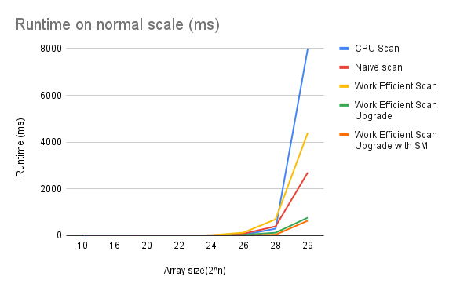
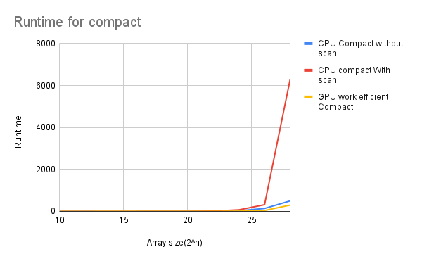

CUDA Stream Compaction
======================

**University of Pennsylvania, CIS 565: GPU Programming and Architecture, Project 2**

* Xiaoxiao Zou
  * [LinkedIn](https://www.linkedin.com/in/xiaoxiao-zou-23482a1b9/)
* Tested on: Windows 11, AMD Ryzen 9 7940HS @ 4.00 GHz, RTX 4060 Laptop 

### Implementations:
I implemented basic CPU scan & compact, GPU naive scan, GPU work efficient scan & compact, Thrust scan. In addition to those, I also implemented GPU work efficient scan Upgrade, GPU work efficient scan Upgrade with Shared Memory. 

The four basic implementations just followed the instructions from slide. 

<b>GPU Work efficient: </b> Benchmark with all modulo operations and multiply operations converted to bitwise operations (give fair amount of speedup).

<b>GPU Work efficient scan Upgrade: </b> I calculated actual number of blocks will be needed will be needed for each round of  up sweep and down sweep in order to reduce number of blocks (total number of threads) need to be launched each time. This gives around up to <b>5x speedup</b>. 

<b>GPU Work efficient scan Upgrade with Shared Memory: </b> I used shared memory to do block-wise scan for each block, then, I do scan on the increments. At last, I add increments back to block. Here, I made a design choice for the scan on increments, for this scan, I use GPU Work efficient scan Upgrade method instead of GPU Work efficient scane Upgrade with shared memory. By implementing GPU Work efficient scan Upgrade with shared memory on increments array will result in recursive looping on increments array. (I tried to do it just by appending new increments array to old one). However, I found that actually slow the performance somehow due to the need to addition from new increments array to old arrays. I found just using simple GPU Work efficient scan Upgrade is not that bad. This overall give up to <b>16x speedup</b>.

Blocksize limitation: by doing shared memory, my block size will be limited to block size 64, (starting at 128, I think there is some memory conflict inside each block, which resulting in error). For other methods, blocksize does not influence performance that much starting at blocksize 32. (if block size too small, will slow down performance project 1)

### Performance Analysis




The one thing I noticed first is my CPU is way stronger than I thought. Only when it reachs array=2^24, it starts to show up slowdown on performance. But right after 2^28, my CPU is no longer compatible of doing this arithematics.

For general GPU side performance, it starts to showing slowing down when it reachs 2^20. For thrust, it starts to slow down on 2^28. (I personally think it will 2^28 is the bottleneck, since at 2^29, 50ms implies 20fps and this only counts the calculation for scan not including those memory operations). My Work efficient method is not effiecient at all, however, the upgrade one gives fairly good opitimization compared to naive one. The one with upgrade SM gives fairly good optimization compared to upgrade especially at 2^28.

Some potential opitimization: by observing thrust, I found there is some insufficient threads usage for my SM method. In upgrade method, there is a way to just not lauching the threads in kernel. However, for SM one, although I am only launching blocksize/2 threads for each block, but when they are sweeping, most time there is only part of threads are working in the block. I dont know is there any more wise way to use those threads (probably just do mutiple additions at once, like two or three layers all together when downsweep). Another opitimization I would think of, swapping is not essentially needed if there is a wise way to just caculated the index to do the computation. 

#### Output for arraysize=2^26
```

****************
** SCAN TESTS **
****************
    [   2  10  43  45  10  38   5  10  13  25  24  17   9 ...  33   0 ]
==== cpu scan, power-of-two ====
   elapsed time: 30.0245ms    (std::chrono Measured)
    [   0   2  12  55 100 110 148 153 163 176 201 225 242 ... 1643506275 1643506308 ]
==== cpu scan, non-power-of-two ====
   elapsed time: 41.5261ms    (std::chrono Measured)
    [   0   2  12  55 100 110 148 153 163 176 201 225 242 ... 1643506220 1643506227 ]
    passed
==== naive scan, power-of-two ====
   elapsed time: 85.8092ms    (CUDA Measured)
    passed
==== naive scan, non-power-of-two ====
   elapsed time: 82.2282ms    (CUDA Measured)
    passed
==== work-efficient scan, power-of-two ====
   elapsed time: 135.767ms    (CUDA Measured)
    passed
==== work-efficient scan, non-power-of-two ====
   elapsed time: 130.076ms    (CUDA Measured)
    passed
==== work-efficient scan upgrade, power-of-two ====
   elapsed time: 31.5261ms    (CUDA Measured)
    passed
==== work-efficient scan upgrade, non-power-of-two ====
   elapsed time: 31.4493ms    (CUDA Measured)
    passed
==== work-efficient scan upgrade with SM, power-of-two ====
   elapsed time: 11.6919ms    (CUDA Measured)
    passed
==== work-efficient scan upgrade with SM, non-power-of-two ====
   elapsed time: 12.0757ms    (CUDA Measured)
    passed
==== thrust scan, power-of-two ====
   elapsed time: 5.33914ms    (CUDA Measured)
    passed
==== thrust scan, non-power-of-two ====
   elapsed time: 5.62893ms    (CUDA Measured)
    passed

*****************************
** STREAM COMPACTION TESTS **
*****************************
    [   3   0   3   2   2   3   3   3   0   3   1   1   0 ...   2   0 ]
==== cpu compact without scan, power-of-two ====
   elapsed time: 139.038ms    (std::chrono Measured)
    [   3   3   2   2   3   3   3   3   1   1   2   1   2 ...   1   2 ]
    passed
==== cpu compact without scan, non-power-of-two ====
   elapsed time: 129.736ms    (std::chrono Measured)
    [   3   3   2   2   3   3   3   3   1   1   2   1   2 ...   3   1 ]
    passed
==== cpu compact with scan ====
   elapsed time: 318.162ms    (std::chrono Measured)
    [   3   3   2   2   3   3   3   3   1   1   2   1   2 ...   1   2 ]
    passed
==== work-efficient compact, power-of-two ====
   elapsed time: 42.9237ms    (CUDA Measured)
    passed
==== work-efficient compact, non-power-of-two ====
   elapsed time: 43.177ms    (CUDA Measured)
    passed
Press any key to continue . . .
```


