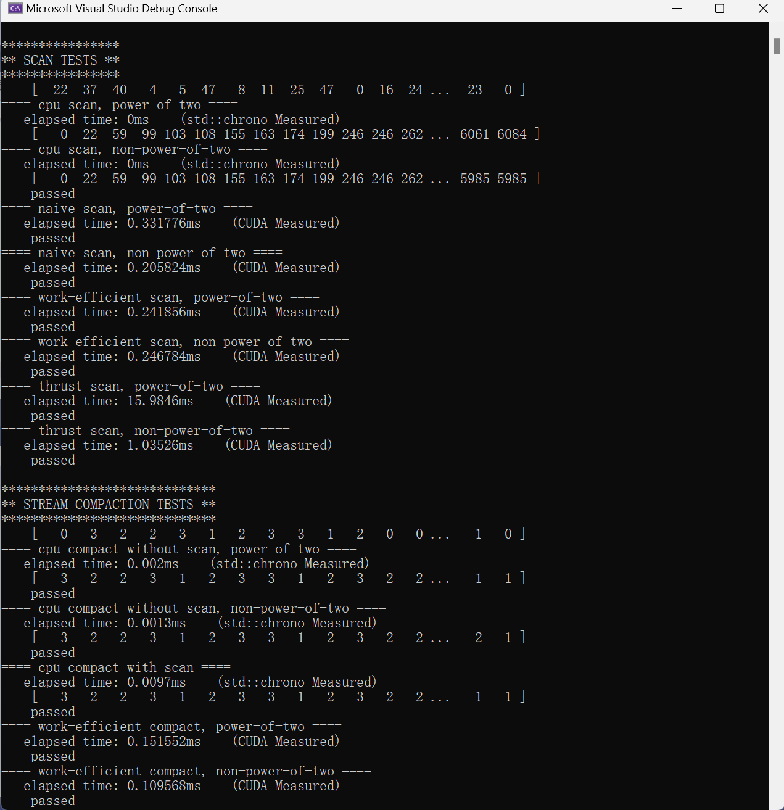

CUDA Stream Compaction
======================

**University of Pennsylvania, CIS 565: GPU Programming and Architecture, Project 2**

Han Wang

Tested on: Windows 11, 11th Gen Intel(R) Core(TM) i9-11900H @ 2.50GHz 22GB, GTX 3070 Laptop GPU

### Analysis
Roughly optimize the block sizes of each of your implementations for minimal run time on your GPU.

(You shouldn't compare unoptimized implementations to each other!)
Compare all of these GPU Scan implementations (Naive, Work-Efficient, and Thrust) to the serial CPU version of Scan. Plot a graph of the comparison (with array size on the independent axis).

We wrapped up both CPU and GPU timing functions as a performance timer class for you to conveniently measure the time cost.

We use std::chrono to provide CPU high-precision timing and CUDA event to measure the CUDA performance.

For CPU, put your CPU code between timer().startCpuTimer() and timer().endCpuTimer().

For GPU, put your CUDA code between timer().startGpuTimer() and timer().endGpuTimer(). Be sure not to include any initial/final memory operations (cudaMalloc, cudaMemcpy) in your performance measurements, for comparability.

Based on my observation in my text, there are three phenomenons:
1. The block size seems to not influence the output that much.
2. The naive gpu approach is slower than the efficient approach.
3. Though I didn't plot out the output of the CPU scan, the CPU operation seems to be actually faster than the GPU operation.

   

Don't mix up CpuTimer and GpuTimer.
To guess at what might be happening inside the Thrust implementation (e.g. allocation, memory copy), take a look at the Nsight timeline for its execution. Your analysis here doesn't have to be detailed, since you aren't even looking at the code for the implementation.
Write a brief explanation of the phenomena you see here.

Can you find the performance bottlenecks? Is it memory I/O? Computation? Is it different for each implementation?
Paste the output of the test program into a triple-backtick block in your README.

