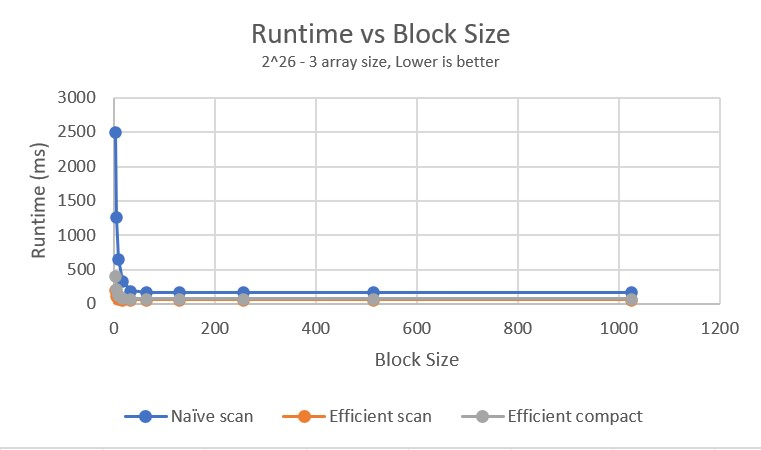
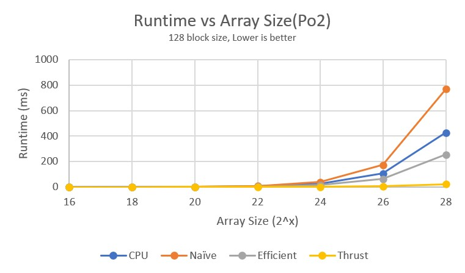
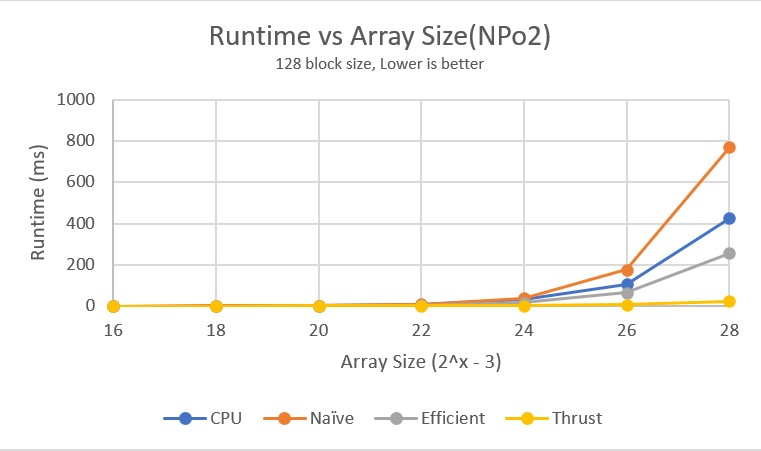
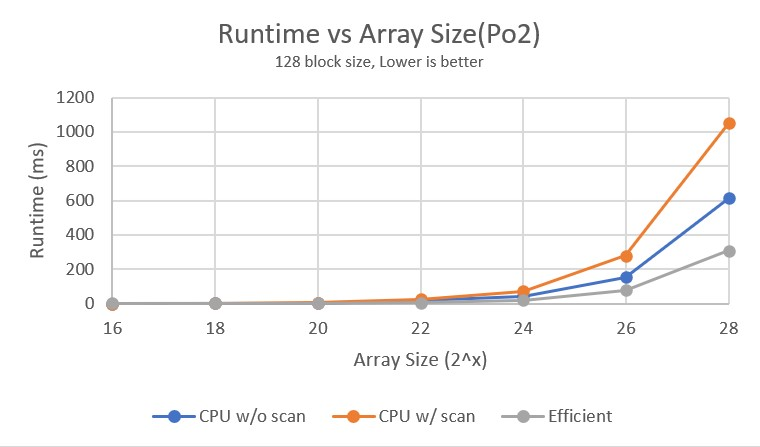
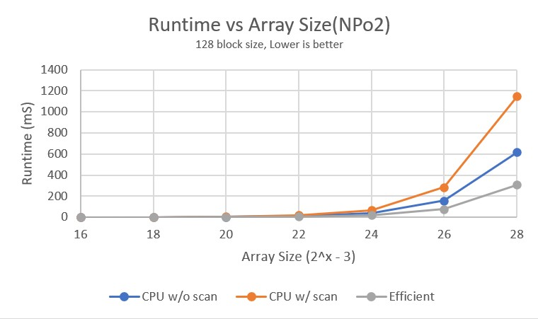
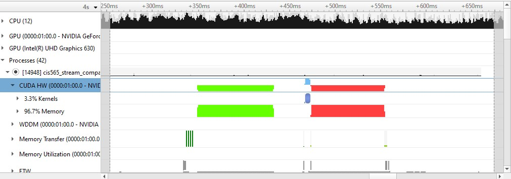

CUDA Stream Compaction
======================

**University of Pennsylvania, CIS 565: GPU Programming and Architecture, Project 2**

* Gene Liu
  * [LinkedIn](https://www.linkedin.com/in/gene-l-3108641a3/)
* Tested on: Windows 10, i7-9750H @ 2.60GHz, 16GB RAM, GTX 1650 Max-Q 4096MB (personal laptop)
  * SM 7.5

### Project 2: Stream Compaction

This project involved the implementation and analysis of several parallel GPU algorithms in CUDA. This included the scan and stream compaction algorithms.

The scan algorithm computes the prefix sum of each element within an array. This project implements *exclusive* scans, meaning at each array index, the elements before that index but not including the index are summed. The naive and work-efficient version of this algorithm are implemented.

Stream compaction utilizes the scan algorithm in filtering an array. In this implementation all array elements with value 0 are filtered, with the stream compaction algorithm returning a compacted array of the remaining non-zero elements.

More information about the implementations can be found at [GPU Gems 3, Chapter 39](https://developer.nvidia.com/gpugems/GPUGems3/gpugems3_ch39.html).

This project compares the GPU, CPU, and thrust library implementations of these algorithms for performance analysis.

## Performance Analysis

All data was produced by running the same function block 10 times in a loop, then programmatically averaging to produce the final runtime.

### Block Size

First, the optimal block size for the naive and work efficient scans as well as the work efficient stream compmact was found. This was done by maintaining a constant array size of 2^26 elements and varying the block size by powers of 2. The following results were obtained:


The same procedure was run on a non power of 2 array size of 2^26 - 3, with the following similar results:



Past a block size of 64, it seems that no further runtime improvements can be observed. This is likely due to the blocks being big enough for the GPU to fully leverage its parallelism, having enough threads at any given moment to run. Thus, going forward, any performance analysis will be done at a block size of 128.

### Scan

To compare the performance of the different scan algorithm implementations, the array size operated on was varied. For arrays of size equal to some power of 2, the following data was obtained:



Similarly for non power of 2 size arrays(2^x - 3), the following graph was produced:



Overall the naive GPU implementation turned out to be the slowest. This was rather surprising since even though the implementation is inefficient, it is still parallelized on a GPU and should thus be more efficient than the CPU serial version, especially at larger array sizes. This was not the case, however, as the CPU version seemed to consistently outperform the naive implementation. This could be due to the IO overhead associated with ping ponging between two global memory buffers between naive scan iterations as well as the conditional branch between elements with values greater than the iteration offset and those less. These could cause longer kernel times and so overall longer runtimes for the naive scan. The hardware specs of the CPU and GPU in my personal device could have also contributed to this difference, if the CPU itself is relatively more powerful. 

The efficient GPU implementation ran faster than the CPU version, which is as expected due to the multiple optimizations and reduced operation count from the naive implementation, fully utilizing the parallelization of the GPU at lower overhead. Initially this was not the case, but after reducing CUDA memory operations and performing more kernel transforms in place this runtime was reduced. Another main difference to the naive version is that each iteration of the up and down sweep start just enough threads to perform all needed operations, while the naive implementation needs to start a number of threads equal to the array size every iteration.

The thrust implementation was significantly faster than any of the other implementations. This is likely due to the use of local shared memory rather than global memory combined with other optimizations by NVIDIA.

### Stream Compaction

The stream compaction algorithms(CPU with and without scan, GPU work efficient) were compared in a similar manner, by varying the array sizes. For powers of 2 array sizes, the following data was obtained:



And once again for non power of 2 array sizes(2^x - 3), this was the resulting graph:



These results were as expected, with the CPU with scan performing the worst, then CPU with scan, then the GPU version. The CPU with scan performs additional operations in creating a filter map, running a scan, then constructing the final result. This requires about 3 passes over an array of size `n` In contrast, the CPU version without scan directly tracks the index while filtering through the input array in a single pass, which only requires a single pass. The GPU work-efficient version does still construct the filter map and performs a scan, as otherwise individual GPU threads cannot communicate about the resulting array index of the elements. However, the parallelization of the GPU significantly speeds up each step, which results in an overall reduced runtime. The CPU variants, bottlenecked by the CPU clock speed in its serial execution, hence performs worse.

### Thrust Nsight Analysis

The following Nsight trace was run on a thrust function call on an array of size 2^28. All other tests were disabled to isolate this test case



It seems the function spent 96.7% of its time performing memory IO operations and only 3.3% actually in kernels. This shows that with GPU CUDA parallel algorithms, memory often serves as the bottleneck for runtime, even in very optimized implementations like the thrust one. If the shared memory hypothesis above is correct, this would mean that the GPU implementations in this project are significantly memory IO bottlenecked, spending likely 99%+ of their time performing IO operations.

## Test Output
For an array size of 2^26, the following test output was produced:
```
****************
** SCAN TESTS **
****************
    [   7   2  40  47  25  31  48   9  31   9  26  44   4 ...  44   0 ]
==== cpu scan, power-of-two ====
   elapsed time: 148.29ms    (std::chrono Measured)
    [   0   7   9  49  96 121 152 200 209 240 249 275 319 ... 1643821861 1643821905 ]
==== cpu scan, non-power-of-two ====
   elapsed time: 151.05ms    (std::chrono Measured)
    [   0   7   9  49  96 121 152 200 209 240 249 275 319 ... 1643821781 1643821824 ]
    passed
==== naive scan, power-of-two ====
   elapsed time: 173.846ms    (CUDA Measured)
    passed
==== naive scan, non-power-of-two ====
   elapsed time: 176.028ms    (CUDA Measured)
    passed
==== work-efficient scan, power-of-two ====
   elapsed time: 64.8613ms    (CUDA Measured)
    passed
==== work-efficient scan, non-power-of-two ====
   elapsed time: 63.4028ms    (CUDA Measured)
    passed
==== thrust scan, power-of-two ====
   elapsed time: 6.65597ms    (CUDA Measured)
    passed
==== thrust scan, non-power-of-two ====
   elapsed time: 6.68195ms    (CUDA Measured)
    passed

*****************************
** STREAM COMPACTION TESTS **
*****************************
    [   2   3   1   0   3   0   3   2   2   0   1   2   2 ...   2   0 ]
==== cpu compact without scan, power-of-two ====
   elapsed time: 205.587ms    (std::chrono Measured)
    [   2   3   1   3   3   2   2   1   2   2   3   3   3 ...   2   2 ]
    passed
==== cpu compact without scan, non-power-of-two ====
   elapsed time: 205.061ms    (std::chrono Measured)
    [   2   3   1   3   3   2   2   1   2   2   3   3   3 ...   1   2 ]
    passed
==== cpu compact with scan, power-of-two ====
   elapsed time: 434.216ms    (std::chrono Measured)
    [   2   3   1   3   3   2   2   1   2   2   3   3   3 ...   2   2 ]
    passed
==== cpu compact with scan, non-power-of-two ====
   elapsed time: 434.588ms    (std::chrono Measured)
    [   2   3   1   3   3   2   2   1   2   2   3   3   3 ...   1   2 ]
    passed
==== work-efficient compact, power-of-two ====
   elapsed time: 76.1731ms    (CUDA Measured)
    passed
==== work-efficient compact, non-power-of-two ====
   elapsed time: 77.1793ms    (CUDA Measured)
    passed
```
